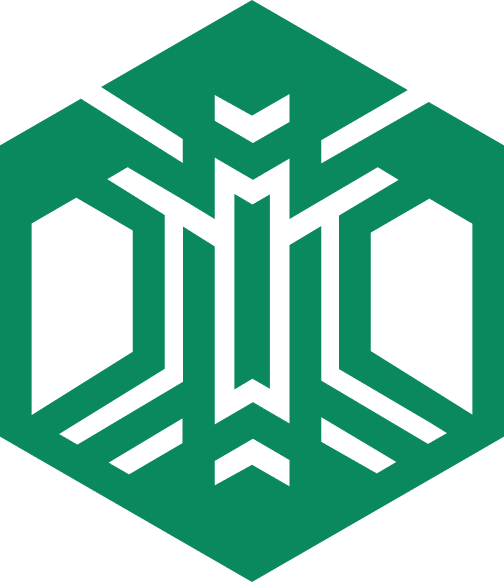
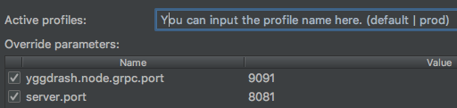

#  Yggdrash

> We will change the world by blockchain.

[](https://travis-ci.org/yggdrash/yggdrash)
[](https://coveralls.io/github/yggdrash/yggdrash?branch=develop)
[](https://codecov.io/gh/yggdrash/yggdrash)

## What is yggdrash?

YGGDRASH is a trust-based multi-dimensional blockchains (branches) built with a vision to “Digitize everything into reality” and to connect everything and any blockchain networks.

## Table of contents

* [Documentation](#documentation)
* [Development](#development)
    * [Requirements](#requirements)
    * [Getting the source](#getting-the-source)
    * [Running node](#running-locally)
    * [Running on Docker](#running-on-docker)
    * [Building for production](#building-for-production)
    * [Running Tests](#running-tests)
* [APIs](#apis)
* Using Docker to simplify development (optional)
* Continuous Integration and Continuous Delivery (optional)
* [Stay in Touch](#stay-in-touch)


## Documentation
Learn more by reading the [yggdrash technical document](docs) and full documentation, visit [wiki](https://github.com/yggdrash/yggdrash/wiki)


## Development
This is the implementation written in Java and runs on Linux, OSX and Windows.

### Requirements

Yggdrash requires `JAVA` 1.8+ compiler to build. To install Java, follow this [link](http://www.oracle.com/technetwork/java/javase/overview/index.html).

### Getting the source

Clone the yggdrash repo:

```
git clone https://github.com/yggdrash/yggdrash.git
cd yggdrash
```
> If you are unfamiliar with Git, [Download ZIP](https://github.com/yggdrash/yggdrash/archive/master.zip) (source code)

### Running locally

To run the cloned repository in the spring default profile, simply run:
```
./gradlew
```
To run the multiple nodes in IntelliJ IDE, edit the run configuration:



### Running on Docker
You can fully dockerize the yggdrash node. For more information refer to [docker](docker).

Docker is one quick way for running an yggdrash node:

```
docker --rm -p 8080:8080 -p 32918:32918 -h yggdrash-node1 --name yggdrash-node1 yggdrash/yggdrash-node
```

Yggdrash node binds to `localhost` using `8080` for the RESTful API & JSON RPC, and `32918` for the gRPC by default.

You can also use other ports by providing options like `-p 8081:8080`

The [Dockerfile](Dockerfile) is designed to build automatically the last release of the source code and will publish docker images to [dockerhub](https://hub.docker.com/r/yggdrash/yggdrash-node/) by release, feel free to fork and build Dockerfile for your own purpose.

### Building for production

To optimize the yggdrash application for production, run:
```
./gradlew -PspringProfiles=prod clean build
```

To ensure everything worked, run:
```
yggdrash-node/build/libs/*.jar
```

To find out usages of all command line options:

- `--server.address=value` JSON RPC & RESTful API services listening address
- `--server.port=value` JSON RPC & RESTful API services listening port
- `--yggdrash.node.grpc.host=value` gRPC service listening address
- `--yggdrash.node.grpc.port=value` gRPC service listening port
- `--yggdrash.node.max-peers=value` maximum number of P2P network peers (default: 25)

### Running Tests
To launch yggdrash's tests, run:
```
./gradlew test
```
This command would run the integration tests without gradle task caching:
```
./gradlew test -PspringProfiles=ci --rerun-tasks
```


## APIs

Once yggdrash node started, the blocks can be shown in your browser. e.g. [http://localhost:8080/blocks](http://localhost:8080/blocks)

- refer to more [JSON RPC API](docs/api/jsonrpc-api.md)


## Using Docker to simplify development (optional)

You can use docker to improve yggdrash development experience. A number of docker-compose configuration are available in the [docker](docker) folder to launch with third party services.

For example, to start the multiple nodes in a docker container, run:
```
docker-compose -f docker/docker-compose.yml up -d
```

To stop it and remove the container, run:
```
docker-compose -f docker/docker-compose.yml down
```


## Continuous Integration & Continuous Delivery (optional)

Yggdrash should support the following CI systems out of the box:
- Jenkins: Setting up Jenkins
   - Just use the [docker/jenkins.yml](docker/jenkins.yml) file. So you can test Jenkins locally by running:
```
docker-compose -f docker/jenkins.yml up -d
```
- Travis: refer to the [Travis Documentation](https://docs.travis-ci.com/user/getting-started/)

### To configure CI for Yggdrash project in Jenkins, use the following configuration:
```
* Project name: `Yggdrash`
* Source Code Management
    * Git Repository: `git@github.com:yggdrash/yggdrash.git`
    * Branches to build: `*/master`
    * Additional Behaviours: `Wipe out repository & force clone`
* Build Triggers
    * Poll SCM / Schedule: `H/5 * * * *`
* Build
    * Invoke Gradle script / Use Gradle Wrapper / Tasks: `-PspringProfiles=prod clean build`
    * Execute Shell / Command:
        ````
        ./gradlew bootRun &
        bootPid=$!
        sleep 30s
        kill $bootPid
        ````
* Post-build Actions
    * Publish JUnit test result report / Test Report XMLs: `build/test-results/*.xml`
```
What tasks/integrations in the [Jenkins pipeline file](Jenkinsfile) :

- Perform the build in a Docker container
- Analyze code with Sonar
- Build and publish a Docker image


## Stay in Touch
Follow [@yggdrash](https://www.facebook.com/yggdrash), [@YggdrashNews](https://twitter.com/YggdrashNews)
and releases are announced via our [Yggdrash Official](https://medium.com/@yggdrash) on SNS also.
Its team members on [Yggdrash Website](https://yggdrash.io/#team)


## License
The Yggdrash is released under version 2.0 of the [Apache License](LICENSE).
