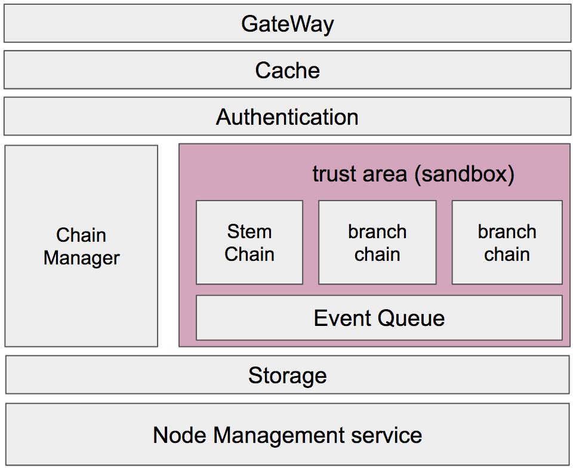

# Architecture

## GateWay
- network area
    - Grpc method
    - jsonrpc method
    - resful method

## Cache
- synced blockchain network address
- block data
- unconfirmed transaction pool
- pending block
- auth cache

## Authentication
- node access
- issue client token
- blockchain access control
- blockchain data access control
- node information access

## Blockchan Area

### Chain Manager
### Chain Event

## Storage Manager

## Node Management Services
* Node Log
* Node Status api
* excute method
    * reload
    * shutdown (kill)
    * stop
