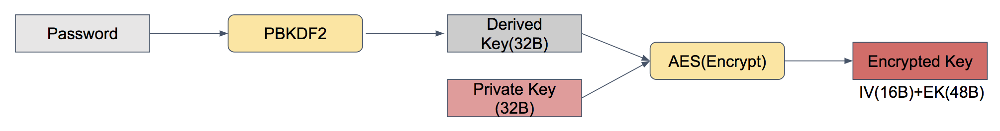
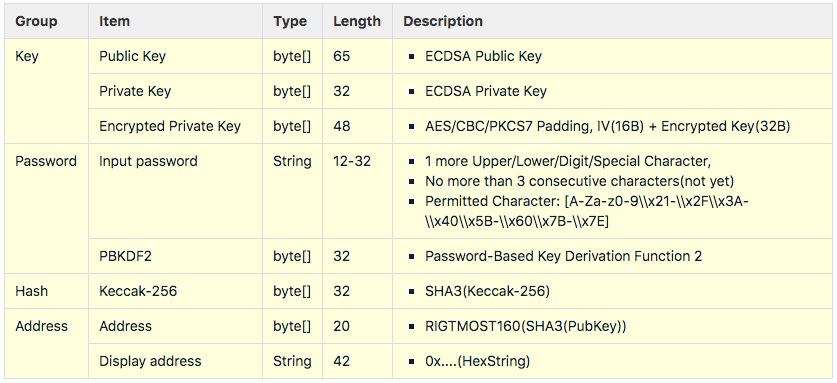

# KeyStore 
- 이 문서는 이그드라시 키스토어에 관해 설명합니다.

## Algorithm
- 키 알고리즘은 ECDSA secp256k1 알고리즘을 사용합니다.
- 개인키는 32 Byte, 공개키는 65 Byte, 서명값은 65 Byte 입니다.
- 해시 알고리즘은 SHA3(KECCAK-256)을 사용합니다. 32 Byte 데이터를 출력합니다.
- 주소는 공개키를 SHA3 해쉬한 값의에서 뒤로부터 20 Byte를 사용합니다.
- 주소 표기는 0x로 시작하고 20Byte 주소값을 핵사값으로 표기합니다.
> ex) 0x056a8143fdc7416a9b8d59cb4196930588731e9b   

## Key encryption password
- 개인키를 암호화하는 알고리즘은 AES/CBC/PKCS7Padding 입니다.
- 패스워드 기반 유도 알고리즘은 PBKDF2 이고, 32 Byte의 대칭키(AES)가 유도됩니다.
- 패스워드 길이는 12 ~ 32입니다.
- 1자 이상의 대문자/소문자/숫자/특수기호를 각각 포함해야합니다.
- 특수기호는 ASCII 코드표에서 출력가능한 문자(0x21-0x2F, 0x3A-0x40, 0x5B-0x60, 0x7B-0x7E)만 허용합니다.
> <https://en.wikipedia.org/wiki/ASCII>

## Key File
- 키파일은 설정파일에 지정된 디렉토리와 파일명으로 저장됩니다.
> ex) $WORK_DIR$/.keystore/nodePri.key
- 키파일은 IV(16Byte)와 암호화된키값(48Byte)으로 구성됩니다.

