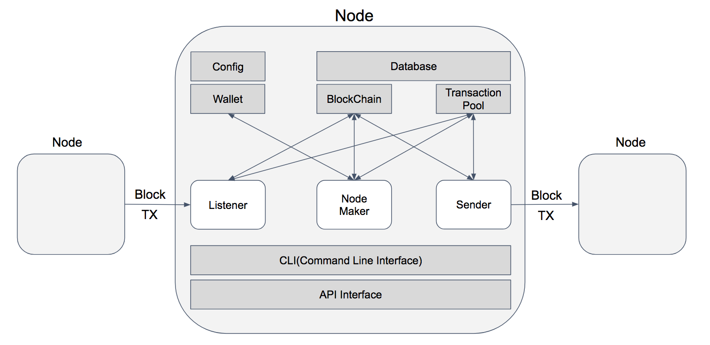

# Node 
- 이 문서는 이그드라시 노드에 관해 설명합니다.

## Config
- yggdrash.conf 설정 파일에 정의합니다.
- 설정 파일 문법은 다음을 참고합니다.
> <https://github.com/lightbend/config/blob/master/HOCON.md>

## Process
1. Configuration 파일을 로드합니다.
2. NodeKey Password를 입력 받습니다.
3. NodeKey를 복호화하여 메모리에 로드합니다. NodeKey는 블록/트랜잭션 생성시 전자서명, 서명검증, 암호세션 생성 등에 사용됩니다.
4. Block Sync 상태를 체크합니다.
5. NodeService를 실행합니다. Block 및 Transaction을 수신하고 검증하고, 생성하고, 전파합니다.
6. APIService를 실행합니다. Block 및 Transaction을 수신하고 조회합니다.

## Component

