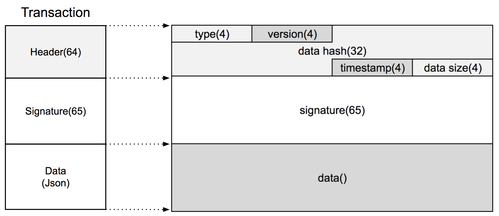

# Transaction 
- 이 문서는 이그드라시 트랜잭션에 관해 설명합니다.(v0.0.2)

## Structure

- Transaction은 Header(64Byte), Signature(65Byte), Data로 구성됩니다.
- Header는 type(4Byte), version(4Byte), data hash(32Byte), timestamp(4Byte), data size(4Byte)로 구성됩니다.
- type은 network 구분, transaction 종료 등 다양한 용도로 사용됩니다. 세부 사양은 아직 확정되지 않았습니다.
- version은 application 구분 등 다양한 용도로 사용됩니다. 세부 사양은 아직 확정되지 않았습니다.
- previous block hash는 이전 블록의 해쉬값입니다.
- merkle root는 data에 저장된 transaction 들의 merkle root입니다.
- timestamp는 UTC 시간정보입니다.
- data size는 data 필드의 크기입니다.
- Signature는 Header의 전자서명값입니다.
- Data는 JSon 형식입니다.

